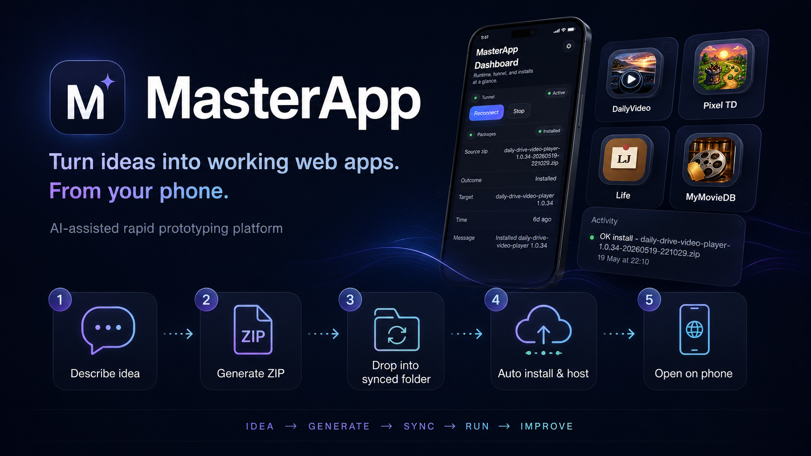

# MasterApp



MasterApp is a phone-first, AI-assisted rapid prototyping platform for turning ideas into small working web apps.

The main goal is simplicity: describe an app idea to ChatGPT, save the generated ZIP into a synced Google Drive folder, and open the installed app from the phone through MasterApp. The Windows tray app is only the local automation layer behind the workflow.

## The simple workflow

1. Describe an app idea to ChatGPT.
2. Save the generated ZIP into a synced Google Drive folder.
3. MasterApp automatically validates, installs, and hosts the app on the home Windows machine.
4. Open the new app from the phone.
5. Don't like something? Send a screenshot back to ChatGPT and generate the next version.

## Why this project exists

MasterApp hides the infrastructure complexity behind a simple phone workflow. The package contract, manifest validation, local hosting, Google Drive sync, Cloudflare Tunnel access, processed/failed folders, logs, and app state are handled by the platform so the idea-to-running-prototype loop stays simple.

## Clean project layout

- `src/MasterApp/` - the .NET 8 Windows application
- `scripts/` - the only maintenance scripts you should need
- `templates/state/` - starter state files: `settings.example.json`, `secrets.example.json`, and `runtime-state.example.json`
- `docs/` - package format and LLM authoring references
- `sample-package/` - a minimal sample package for testing

Generated files are kept out of the repository. Release builds and share zips are written to `artifacts/` when you run the scripts.

## Requirements

- Windows 10 or Windows 11
- .NET 8 SDK
- `cloudflared`
- Google Drive for Desktop if you want published builds to sync through Google Drive

## First-time setup

1. Clone the repository.
2. Run `scripts\setup-local-state.bat`.
   This creates `%LOCALAPPDATA%\MasterApp\State\settings.json`, `%LOCALAPPDATA%\MasterApp\State\secrets.json`, and `%LOCALAPPDATA%\MasterApp\State\runtime-state.json` from the templates in `templates/state/`.
3. Open `%LOCALAPPDATA%\MasterApp\State\settings.json`.
4. Set `cloudflaredPath` to your local `cloudflared.exe`.
5. Choose your working folders for `incomingFolder`, `processedFolder`, `failedFolder`, and `publishedFolder`.
6. Open `%LOCALAPPDATA%\MasterApp\State\secrets.json`.
7. Add your own Cloudflare tunnel token, hostname, and local port.
8. In `%LOCALAPPDATA%\MasterApp\State\settings.json`, confirm `workspacePaths`, `codexCommand`, `preferredBuildCommand`, and `preferredRestartCommand` for the new Codex tab.

`templates/state/secrets.example.json` contains placeholders only. Do not commit real secrets into this repository.

## Cloudflare setup for another user

Every user should use their own Cloudflare account and tunnel.

1. Install `cloudflared` on that machine.
2. Create a tunnel in that user’s Cloudflare account.
3. Create a public hostname for the tunnel.
4. Copy the tunnel token into `%LOCALAPPDATA%\MasterApp\State\secrets.json`.
5. Put the matching hostname into `publicHostname`.

MasterApp does not ship account-specific Cloudflare credentials in this repository.

## Google Drive folder sync

If you want published builds to land in Google Drive, point the folder paths in `settings.json` to a Google Drive for Desktop folder, for example:

```json
{
  "incomingFolder": "G:\\My Drive\\MasterApp\\Incoming",
  "processedFolder": "G:\\My Drive\\MasterApp\\Processed",
  "failedFolder": "G:\\My Drive\\MasterApp\\Failed",
  "publishedFolder": "G:\\My Drive\\MasterApp\\Published"
}
```

That way:

- new package zips can be dropped into the synced `Incoming` folder
- processed and failed packages are easy to review
- published builds are automatically shared through the synced `Published` folder

## Inbox package flow

Think of `incomingFolder` as the MasterApp inbox.

1. Create or receive a single app `.zip`.
2. Drop that zip into the configured `Incoming` folder.
3. MasterApp extracts it, validates `app.manifest.json`, and builds it during install if it is a `source` package.
4. On success, the zip is moved to `Processed` and the app is installed under `%LOCALAPPDATA%\MasterApp\Apps\...`.
5. On failure, the zip is moved to `Failed` so the package and logs can be reviewed.
6. If the manifest includes a `publish` block, MasterApp can later publish output into the configured `Published` folder.

For the exact package contract, see `docs/app-package-spec.md`.

## Scripts

- `scripts\run-masterapp.bat` - run the app from source
- `scripts\build-release.bat` - create a self-contained release build in `artifacts\release`
- `scripts\setup-local-state.bat` - create the local state files from templates
- `scripts\create-share-zip.bat` - build a clean source zip for another developer
- `scripts\collect-logs.bat` - create `Desktop\MasterApp_Logs.zip` without exposing `secrets.json`

## Codex Chat panel

MasterApp now includes a `Codex` tab that uses the local Codex CLI already signed in on the machine.

- the tab reads model choices and recent chats from the local Codex state in `%USERPROFILE%\.codex\`
- the main chat stays async and clean: your prompt, a `Processing...` state, approval cards, and the final answer
- every requested command pauses for approval before MasterApp executes it
- allowed workspaces come from `settings.json -> workspacePaths`
- model changes update the local Codex default in `config.toml`
- build and restart requests stay under MasterApp control
- before a self-restart, MasterApp backs up state from `%LOCALAPPDATA%\MasterApp\State\` into `%LOCALAPPDATA%\MasterApp\State\Backups\`
- the relaunch helper writes a marker so the restarted app can report restart status in the Codex tab
- logs, changed files, build output, executable resolution, and restart details live behind the Codex details panel instead of the main chat

Suggested local values:

```json
{
  "codexCommand": "codex",
  "workspacePaths": [
    "C:\\Dev\\MasterApp"
  ],
  "preferredBuildCommand": "dotnet build .\\src\\MasterApp\\MasterApp.csproj -c Debug",
  "preferredRestartCommand": ".\\scripts\\run-masterapp.bat"
}
```

If you need longer brokered runs in the Codex tab, add optional limits in `%LOCALAPPDATA%\\MasterApp\\State\\settings.json`:

```json
{
  "codexMaxDecisionSteps": 20,
  "ollamaMaxDecisionSteps": 36
}
```

MasterApp now treats those settings as base budgets. The broker automatically increases the effective step budget for harder investigations such as:

- diagnosing the main MasterApp workspace
- working inside installed app packages
- longer investigative or code-change prompts

To help the broker converge faster, a workspace can include an optional `masterapp.ai.json` file at its root. MasterApp reads it and injects the app's own navigation hints into the broker prompt.

## Share the project

Run:

```bat
scripts\create-share-zip.bat
```

This produces `artifacts\share\MasterApp-source.zip` with the source code, scripts, templates, sample package, and docs, but without local build outputs, temporary files, archives, or machine-specific state.

## Build and run

Run from source:

```bat
scripts\run-masterapp.bat
```

Create a release build:

```bat
scripts\build-release.bat
```

## Documentation

- `docs/app-package-spec.md`
- `docs/llm-app-authoring-guide.md`

## Authoring app zips with GPT or another LLM

If you want GPT or another LLM to generate installable app packages for MasterApp, use `docs/llm-app-authoring-guide.md` as the exact instruction set and `docs/app-package-spec.md` as the reference contract.

The important rules to give the model are:

- generate a single inbox-ready `.zip`
- put exactly one `app.manifest.json` at the zip root
- include `masterapp.ai.json` at the zip root whenever possible so brokered agents know where to start
- keep all manifest paths relative
- choose the correct package type: `static`, `portable`, or `source`
- for EXE-based apps, bind to `MASTERAPP_PORT` and expose a health endpoint such as `/api/health`
- include a `publish` block when the app should produce a shareable output later

The sample package and manifest examples are here:

- `sample-package/`
- `sample-package/app.manifest.json`
- `sample-package/masterapp.ai.json`
- `sample-package/portable-app.manifest.sample.json`
- `sample-package/source-app.manifest.sample.json`

## Notes

- Local runtime data lives in `%LOCALAPPDATA%\MasterApp\`
- The repository intentionally excludes build output and local state
- The sample package can be used as a quick install test once you zip it yourself
